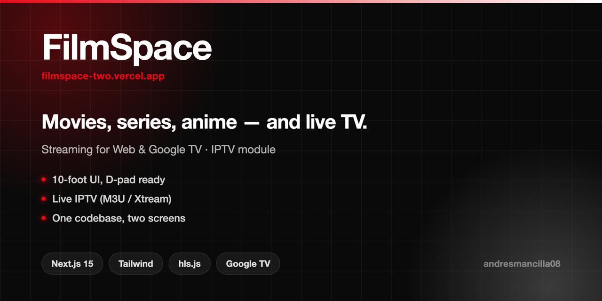

<p align="center">
  
</p>

# FilmSpace

**One media app for the couch and the desk.** A streaming front-end for movies, series and anime, built for **Web** and **Google TV** from a single codebase — plus a live TV module that plays your own IPTV playlists.

🌐 **[filmspace-two.vercel.app](https://filmspace-two.vercel.app)** · Installable PWA · Web + Google TV

> **FilmSpace hosts no media.** Catalog metadata comes from [TMDB](https://www.themoviedb.org/); playback sources are supplied by the person running the app (their own IPTV playlist or provider credentials). No content, playlist or link is bundled, and none is distributed with this repository.

---

## Why it exists

Every streaming UI is built for one input device. A remote-driven 10-foot UI and a mouse-driven web app are usually two separate products — so FilmSpace models focus as a first-class concern instead, and the same components serve a D-pad and a cursor.

## What it does

**Catalog**
- Movies, series and anime, with detail pages, search and filters (genre, year, rating)
- Metadata via TMDB, localized EN / ES

**Live TV (`/live`)**
- Load channels from an **M3U playlist** or **Xtream Codes** credentials
- HLS via `hls.js`, MPEG-TS via `mpegts.js`
- Direct playback first, falling back to a server proxy only when CORS blocks the stream

**Google TV**
- 10-foot UI at 1920×1080, D-pad navigation, focus rings and spatial ordering
- Same routes and components as the web build

**Platform**
- Installable PWA, dark-first design
- Responsive from phone to TV

## Stack

| Layer | Tech |
|---|---|
| Framework | Next.js 15 (App Router, TypeScript) |
| Styling | Tailwind CSS + [Aceternity UI](https://ui.aceternity.com) |
| Motion | Framer Motion · Icons: [Tabler](https://tabler.io/icons) |
| i18n | next-intl (`messages/en.json`, `es.json`) |
| Playback | hls.js · mpegts.js |
| Metadata | TMDB API |
| Hosting | Vercel |

## Architecture notes

- **Playback prefers a direct connection.** `/api/stream` only enters the path when the provider blocks cross-origin requests — proxying every segment would burn bandwidth and CPU for no reason.
- **The proxy validates user-supplied URLs.** Non-HTTP(S) protocols and internal hosts (`localhost`, RFC1918 ranges, `.internal`) are rejected before any fetch, so a pasted URL can't be used to reach private infrastructure. The filter matches hostnames literally and does not resolve DNS — documented as a known ceiling, acceptable for a self-hosted personal app, not for a multi-tenant deployment.
- **Credentials stay on the client.** IPTV playlists and Xtream credentials are entered by the user and are never persisted server-side.
- **One codebase, two input models.** TV focus behaviour lives in shared components rather than a forked TV app.

## Running locally

```bash
npm install
cp .env.local.example .env.local   # TMDB API key
npm run dev                        # http://localhost:3000
```

## Structure

```
src/app/[locale]/       Routes — home · [type]/[id] · watch · search · live · profile · auth
src/app/api/            stream (proxy) · iptv (playlist parsing) · search
src/components/         UI, including Aceternity-based components
src/lib/tmdb.ts         TMDB client
src/i18n + messages/    next-intl config and translations
docs/contexto/          Architecture, conventions, decisions, glossary
```

## Target platforms

| Platform | Resolution | Navigation |
|---|---|---|
| Web | Responsive | Mouse / touch |
| Google TV | 1920×1080 | D-pad remote |
